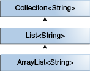

# Generics, Inheritance, and Subtypes 泛型，继承和子类型
As you already know, it is possible to assign an object of one type to an object of another type provided that the types are compatible. For example, you can assign an `Integer` to an `Object`, since `Object` is one of `Integer`'s supertypes:  
众所周知，只要类型兼容，就可以将一种类型的对象分配给另一种类型的对象。例如，你可以将一个`Integer`分配给一个`Object`，因为`Object`是`Integer`的父类型之一：

```java
Object someObject = new Object();
Integer someInteger = new Integer(10);
someObject = someInteger;   // OK
```
In object-oriented terminology, this is called an "is a" relationship. Since an `Integer` is a kind of `Object`, the assignment is allowed. But `Integer` is also a kind of `Number`, so the following code is valid as well:  
用面向对象的术语，这叫做“is a”关系。由于`Integer`是一种`Object`，因此是允许分配的。但是`Integer`也是一种`Number`，因此下面的代码也是有效的：

```java
public void someMethod(Number n) { /* ... */ }

someMethod(new Integer(10));   // OK
someMethod(new Double(10.1));   // OK
```
The same is also true with generics. You can perform a generic type invocation, passing `Number` as its type argument, and any subsequent invocation of add will be allowed if the argument is compatible with `Number`:  
泛型也是如此。你可以执行泛型类型调用，将`Number`作为其类型参数传递，并且任何后续的add调用都会被允许，如果参数与`Number`兼容的话：

```java
Box<Number> box = new Box<Number>();
box.add(new Integer(10));   // OK
box.add(new Double(10.1));  // OK
```
Now consider the following method:  
现在考虑以下方法：
```java
public void boxTest(Box<Number> n) { /* ... */ }
```
What type of argument does it accept? By looking at its signature, you can see that it accepts a single argument whose type is `Box<Number>`. But what does that mean? Are you allowed to pass in `Box<Integer>` or `Box<Double>`, as you might expect? The answer is "no", because `Box<Integer>` and `Box<Double>` are not subtypes of `Box<Number>`.  
什么类型参数会被接收？通过查看其签名，你可以看到它接受一个类型为`Box<Number>`的单个参数。但是它意味着什么？是否就像你期望的那样允许传递`Box<Integer>`或者`Box<Double>`？答案是“不”，因为`Box<Integer>`和`Box<Double>`不是`Box<Number>`的子类型。  
This is a common misunderstanding when it comes to programming with generics, but it is an important concept to learn.  
这是一个常见的误解，当在使用泛型进行编程时，但它是一个需要学习的重要概念。

  
`Box<Integer>` is not a subtype of `Box<Number>` even though `Integer` is a subtype of `Number`.  
`Box<Integer>` 不是 `Box<Number>`的子类，即使 `Integer` 是 `Number`的子类.


>Note: Given two concrete types `A` and `B` (for example, `Number` and `Integer`), `MyClass<A>` has no relationship to `MyClass<B>`, regardless of whether or not `A` and `B` are related. The common parent of `MyClass<A>` and `MyClass<B>` is Object.  
>注意：给定两种具体的类型`A`和`B`（例如`Number`和`Integer`），无论`A`和`B`是否相关，`MyClass<A>`与`MyClass<B>`都没关系。`MyClass<A>`与`MyClass<B>`共同父类是`Object`。

>For information on how to create a subtype-like relationship between two generic classes when the type parameters are related, see [Wildcards and Subtyping](https://docs.oracle.com/javase/tutorial/java/generics/subtyping.html).  
>在类型参数相关时，如何在两个泛型类之间创建类似子类型关系的有关信息，参见[通配符和子类型](Wildcards%20and%20Subtyping%20通配符和子类型.md)。

## Generic Classes and Subtyping 泛型类和子类型
You can subtype a generic class or interface by extending or implementing it. The relationship between the type parameters of one class or interface and the type parameters of another are determined by the extends and implements clauses.  
可以通过扩展或实现泛型类或接口来对其进行子类化。一个类或接口的类型参数与另一类或接口的类型参数之间的关系由extend和Implements子句确定。

Using the `Collections` classes as an example, `ArrayList<E>` implements `List<E>`, and `List<E> extends Collection<E>`. So `ArrayList<String>` is a subtype of `List<String>`, which is a subtype of `Collection<String>`. So long as you do not vary the type argument, the subtyping relationship is preserved between the types.  
用`Collections`类作为例子，`ArrayList<E>`实现了`List<E>`，并且`List<E> extends Collection<E>`，所以`ArrayList<String>`是`List<String>`的子类，它也是`Collection<String>`的子类。只要不改变类型参数，类型之间的子类型关系就会保持不变。


  
A sample `Collections` hierarchy  
示例`Collections`层次结构


Now imagine we want to define our own list interface, `PayloadList`, that associates an optional value of generic type `P` with each element. Its declaration might look like:  
现在，假设我们要定义自己的列表接口`PayloadList`，该接口将泛型类型`P`的可选值与每个元素相关联。 它的声明可能看起来像：

```java
interface PayloadList<E,P> extends List<E> {
  void setPayload(int index, P val);
  ...
}
```
The following parameterizations of `PayloadList` are subtypes of `List<String>`:  
以下`PayloadList`的参数化类型是`List<String>`的子类型：

* PayloadList<String,String>
* PayloadList<String,Integer>
* PayloadList<String,Exception>

  
A sample `PayloadList` hierarchy  
示例`PayloadList`层次结构